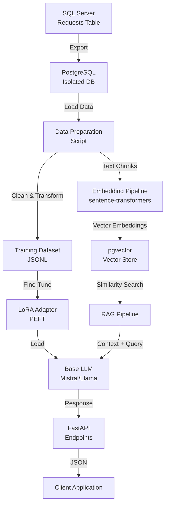

# Complete POC Guide: Custom AI System with RAG + Fine-Tuning

## Table of Contents

1. [High-Level Architecture](#1-high-level-architecture)
2. [Security + IT Considerations](#2-security--it-considerations)
3. [Data Preparation Chapter](#3-data-preparation-chapter)
4. [Vector Database Setup (pgvector)](#4-vector-database-setup-pgvector)
5. [Embedding Pipeline](#5-embedding-pipeline)
6. [RAG Pipeline](#6-rag-pipeline)
7. [Model Selection + "Clearing the Model" Explanation](#7-model-selection--clearing-the-model-explanation)
8. [Fine-Tuning (LoRA/PEFT)](#8-fine-tuning-lorapeft)
9. [Evaluation](#9-evaluation)
10. [API Layer (FastAPI)](#10-api-layer-fastapi)
11. [Full Folder Structure](#11-full-folder-structure)
12. [Learning Path](#12-learning-path)
13. [Later-Stages Roadmap](#13-later-stages-roadmap)

---

## 1. High-Level Architecture

### 1.1 System Overview

This POC builds a complete AI system that can answer questions about your company's "Requests" table using a combination of Retrieval-Augmented Generation (RAG) and fine-tuned language models.

### 1.2 Architecture Diagram



### 1.3 Workflow Narrative

**Phase 1: Data Export & Isolation**

1. Export the Requests table from SQL Server to CSV/JSON
2. Import into isolated PostgreSQL database
3. Sanitize PII and sensitive data
4. Transform into training-friendly format

**Phase 2: Vector Database Setup**

1. Install pgvector extension in PostgreSQL
2. Create schema with requests table and embeddings table
3. Generate embeddings using sentence-transformers
4. Store embeddings in pgvector with proper indexing

**Phase 3: RAG Pipeline**

1. User asks a question
2. Generate embedding for the question
3. Perform similarity search in pgvector (top-K)
4. Retrieve relevant context from requests
5. Assemble prompt with context + question
6. Send to LLM for answer generation

**Phase 4: Fine-Tuning (Optional)**

1. Prepare training dataset from Requests table
2. Choose base model (Mistral 7B, Llama 3 8B, etc.)
3. Apply LoRA/PEFT for efficient fine-tuning
4. Train on company-specific data
5. Save adapter weights

**Phase 5: Integration & Serving**

1. Build FastAPI endpoints
2. Load fine-tuned adapter (if available)
3. Integrate RAG pipeline
4. Serve responses via REST API

### 1.4 SQL Server → PostgreSQL Migration

**Why Export Instead of Direct Connection?**

- **Security**: Isolated environment prevents direct access to production
- **Performance**: No impact on production database
- **Flexibility**: Can transform data structure for ML needs
- **Compliance**: Easier to audit and control data access

**Export Process:**

```sql
-- SQL Server: Export to CSV
-- Run this in SQL Server Management Studio or via Python

-- Option 1: Using BCP (Command Line)
-- bcp "SELECT * FROM Requests" queryout "requests_export.csv" -c -t, -S server_name -d database_name -U username -P password

-- Option 2: Using Python (see Data Preparation section)
```

**PostgreSQL Import:**

```sql
-- PostgreSQL: Create table and import
CREATE TABLE requests_import (
    id SERIAL PRIMARY KEY,
    request_id VARCHAR(50),
    title TEXT,
    description TEXT,
    category VARCHAR(100),
    status VARCHAR(50),
    created_at TIMESTAMP,
    updated_at TIMESTAMP,
    -- Add other columns as needed
    metadata JSONB
);

-- Import from CSV
COPY requests_import FROM '/path/to/requests_export.csv' 
WITH (FORMAT csv, HEADER true, DELIMITER ',');
```

---

## 2. Security + IT Considerations

### 2.1 Why Export Instead of Direct Connection

**Security Benefits:**

- **Network Isolation**: PostgreSQL instance can be on a separate network/VLAN
- **Access Control**: Only ML team has access to isolated database
- **Audit Trail**: All access to exported data is logged separately
- **Data Minimization**: Export only necessary columns, exclude sensitive fields

**Operational Benefits:**

- **No Production Impact**: Zero risk of affecting live SQL Server performance
- **Snapshot Consistency**: Work with a point-in-time snapshot
- **Version Control**: Can version control exported datasets
- **Compliance**: Easier to demonstrate data handling procedures

### 2.2 Risks and Mitigations

| Risk | Impact | Mitigation |
|------|--------|------------|
| **PII Exposure** | High | Automated PII detection and redaction before export |
| **Data Leakage** | High | Encrypt exported files, use secure transfer (SFTP/SCP) |
| **Model Memorization** | Medium | Use differential privacy, limit training epochs |
| **Inference Attacks** | Medium | Rate limiting, query logging, output sanitization |
| **Unauthorized Access** | High | Role-based access control, API keys, network isolation |
| **Model Poisoning** | Medium | Validate training data, use checksums, version control |

### 2.3 Required Permissions

**SQL Server:**

- `SELECT` permission on `Requests` table
- `VIEW DEFINITION` (optional, for schema inspection)
- Read-only access recommended

**PostgreSQL:**

- `CREATE DATABASE` (initial setup)
- `CREATE EXTENSION` (for pgvector)
- `CREATE TABLE`, `INSERT`, `SELECT`, `UPDATE` (for data operations)
- `CREATE INDEX` (for vector indexing)

**System/Infrastructure:**

- Network access to both databases
- Disk space for exported data (estimate: 10-100GB depending on table size)
- GPU access (if fine-tuning) - NVIDIA GPU with 16GB+ VRAM recommended

### 2.4 Data Sanitization Checklist

Before exporting:

- [ ] Remove or redact PII (names, emails, phone numbers, SSNs)
- [ ] Remove or hash sensitive identifiers (customer IDs, account numbers)
- [ ] Remove internal IPs, server names, credentials
- [ ] Anonymize dates if temporal patterns are sensitive
- [ ] Review and exclude columns with proprietary business logic
- [ ] Add synthetic noise to numeric fields if needed (differential privacy)

---

## 3. Data Preparation Chapter

### 3.1 Export Script (Python)

Create `scripts/export_requests.py`:

```python
"""
Export Requests table from SQL Server to PostgreSQL-compatible format.
"""
import pyodbc
import pandas as pd
import json
from datetime import datetime
from pathlib import Path
import logging

logging.basicConfig(level=logging.INFO)
logger = logging.getLogger(__name__)

class RequestExporter:
    def __init__(self, sql_server_config, output_dir="data/raw"):
        self.sql_server_config = sql_server_config
        self.output_dir = Path(output_dir)
        self.output_dir.mkdir(parents=True, exist_ok=True)
    
    def connect_sql_server(self):
        """Establish connection to SQL Server."""
        conn_str = (
            f"DRIVER={{ODBC Driver 17 for SQL Server}};"
            f"SERVER={self.sql_server_config['server']};"
            f"DATABASE={self.sql_server_config['database']};"
            f"UID={self.sql_server_config['username']};"
            f"PWD={self.sql_server_config['password']}"
        )
        return pyodbc.connect(conn_str)
    
    def export_table(self, table_name="Requests", limit=None):
        """
        Export table to CSV and JSON formats.
        
        Args:
            table_name: Name of table to export
            limit: Optional row limit for testing
        """
        logger.info(f"Connecting to SQL Server...")
        conn = self.connect_sql_server()
        
        query = f"SELECT * FROM {table_name}"
        if limit:
            query += f" TOP {limit}"
        
        logger.info(f"Executing query: {query}")
        df = pd.read_sql(query, conn)
        conn.close()
        
        logger.info(f"Exported {len(df)} rows")
        
        # Save to CSV
        csv_path = self.output_dir / f"{table_name.lower()}_export_{datetime.now().strftime('%Y%m%d_%H%M%S')}.csv"
        df.to_csv(csv_path, index=False)
        logger.info(f"Saved CSV to {csv_path}")
        
        # Save to JSON (for easier Python processing)
        json_path = self.output_dir / f"{table_name.lower()}_export_{datetime.now().strftime('%Y%m%d_%H%M%S')}.json"
        df.to_json(json_path, orient='records', date_format='iso')
        logger.info(f"Saved JSON to {json_path}")
        
        # Save metadata
        metadata = {
            "export_date": datetime.now().isoformat(),
            "row_count": len(df),
            "columns": list(df.columns),
            "dtypes": {col: str(dtype) for col, dtype in df.dtypes.items()}
        }
        metadata_path = self.output_dir / f"{table_name.lower()}_metadata.json"
        with open(metadata_path, 'w') as f:
            json.dump(metadata, f, indent=2)
        
        return df, csv_path, json_path
    
    def sanitize_pii(self, df, pii_columns=None):
        """
        Sanitize PII in the dataframe.
        
        Args:
            df: DataFrame to sanitize
            pii_columns: List of column names containing PII
        """
        if pii_columns is None:
            # Auto-detect common PII patterns
            pii_columns = []
            for col in df.columns:
                col_lower = col.lower()
                if any(keyword in col_lower for keyword in ['email', 'phone', 'ssn', 'name', 'address']):
                    pii_columns.append(col)
        
        df_sanitized = df.copy()
        
        for col in pii_columns:
            if col in df_sanitized.columns:
                logger.info(f"Redacting column: {col}")
                # Replace with hash or placeholder
                df_sanitized[col] = df_sanitized[col].apply(
                    lambda x: f"[REDACTED_{hash(str(x)) % 10000}]" if pd.notna(x) else x
                )
        
        return df_sanitized

if __name__ == "__main__":
    # Configuration
    sql_server_config = {
        "server": "your-sql-server.database.windows.net",
        "database": "your_database",
        "username": "your_username",
        "password": "your_password"  # Use environment variables in production!
    }
    
    exporter = RequestExporter(sql_server_config)
    
    # Export (use limit for testing)
    df, csv_path, json_path = exporter.export_table(limit=1000)  # Remove limit for full export
    
    # Sanitize PII
    df_sanitized = exporter.sanitize_pii(df)
    
    # Save sanitized version
    sanitized_path = exporter.output_dir / f"requests_sanitized_{datetime.now().strftime('%Y%m%d_%H%M%S')}.csv"
    df_sanitized.to_csv(sanitized_path, index=False)
    logger.info(f"Saved sanitized data to {sanitized_path}")
```

### 3.2 Data Cleaning & Transformation

Create `scripts/prepare_training_data.py`:

```python
"""
Transform Requests table into training-friendly format.
"""
import pandas as pd
import json
from pathlib import Path
import re
from typing import List, Dict

class TrainingDataPreparer:
    def __init__(self, input_path, output_dir="data/processed"):
        self.input_path = Path(input_path)
        self.output_dir = Path(output_dir)
        self.output_dir.mkdir(parents=True, exist_ok=True)
    
    def load_data(self):
        """Load exported data."""
        if self.input_path.suffix == '.csv':
            return pd.read_csv(self.input_path)
        elif self.input_path.suffix == '.json':
            return pd.read_json(self.input_path, orient='records')
        else:
            raise ValueError(f"Unsupported file format: {self.input_path.suffix}")
    
    def combine_text_fields(self, df, text_columns=None):
        """
        Combine multiple text columns into a single text field.
        
        Args:
            df: Input dataframe
            text_columns: List of columns to combine (default: auto-detect)
        """
        if text_columns is None:
            # Auto-detect text columns
            text_columns = [col for col in df.columns 
                          if df[col].dtype == 'object' and col not in ['id', 'request_id']]
        
        def combine_row(row):
            parts = []
            for col in text_columns:
                if pd.notna(row[col]) and str(row[col]).strip():
                    parts.append(f"{col}: {str(row[col]).strip()}")
            return " | ".join(parts)
        
        df['combined_text'] = df.apply(combine_row, axis=1)
        return df
    
    def chunk_text(self, text, max_chunk_size=512, overlap=50):
        """
        Split long text into chunks for embedding.
        
        Args:
            text: Text to chunk
            max_chunk_size: Maximum characters per chunk
            overlap: Character overlap between chunks
        """
        if len(text) <= max_chunk_size:
            return [text]
        
        chunks = []
        start = 0
        
        while start < len(text):
            end = start + max_chunk_size
            chunk = text[start:end]
            
            # Try to break at sentence boundary
            if end < len(text):
                last_period = chunk.rfind('.')
                last_newline = chunk.rfind('\n')
                break_point = max(last_period, last_newline)
                if break_point > max_chunk_size * 0.5:  # Only break if reasonable
                    chunk = chunk[:break_point + 1]
                    end = start + break_point + 1
            
            chunks.append(chunk.strip())
            start = end - overlap
        
        return chunks
    
    def prepare_rag_dataset(self, df):
        """
        Prepare dataset for RAG (embedding + retrieval).
        Returns list of documents with metadata.
        """
        df = self.combine_text_fields(df)
        
        documents = []
        for idx, row in df.iterrows():
            # Chunk if necessary
            chunks = self.chunk_text(row['combined_text'])
            
            for chunk_idx, chunk in enumerate(chunks):
                doc = {
                    "id": f"{row.get('id', idx)}_{chunk_idx}",
                    "text": chunk,
                    "metadata": {
                        "request_id": row.get('request_id', ''),
                        "category": row.get('category', ''),
                        "status": row.get('status', ''),
                        "created_at": str(row.get('created_at', '')),
                        "chunk_index": chunk_idx,
                        "total_chunks": len(chunks)
                    }
                }
                documents.append(doc)
        
        return documents
    
    def prepare_finetuning_dataset(self, df, question_template=None):
        """
        Prepare dataset for fine-tuning (instruction-following format).
        
        Args:
            df: Input dataframe
            question_template: Function to generate questions from row
        """
        if question_template is None:
            def default_question_template(row):
                return f"What is the status and details of request {row.get('request_id', 'N/A')}?"
        
        training_examples = []
        
        for idx, row in df.iterrows():
            # Generate question
            question = question_template(row)
            
            # Generate answer from row data
            answer_parts = []
            for col in df.columns:
                if col not in ['id', 'request_id'] and pd.notna(row[col]):
                    answer_parts.append(f"{col}: {row[col]}")
            
            answer = "\n".join(answer_parts)
            
            # Format as instruction-following example
            example = {
                "instruction": "Answer questions about company requests based on the provided information.",
                "input": question,
                "output": answer,
                "metadata": {
                    "request_id": row.get('request_id', ''),
                    "category": row.get('category', '')
                }
            }
            training_examples.append(example)
        
        return training_examples
    
    def save_jsonl(self, data, filename):
        """Save data as JSONL (one JSON object per line)."""
        output_path = self.output_dir / filename
        with open(output_path, 'w', encoding='utf-8') as f:
            for item in data:
                f.write(json.dumps(item, ensure_ascii=False) + '\n')
        print(f"Saved {len(data)} items to {output_path}")
        return output_path

if __name__ == "__main__":
    preparer = TrainingDataPreparer("data/raw/requests_export_20240101_120000.json")
    
    df = preparer.load_data()
    print(f"Loaded {len(df)} rows")
    
    # Prepare RAG dataset
    rag_docs = preparer.prepare_rag_dataset(df)
    preparer.save_jsonl(rag_docs, "rag_documents.jsonl")
    
    # Prepare fine-tuning dataset
    finetune_examples = preparer.prepare_finetuning_dataset(df)
    preparer.save_jsonl(finetune_examples, "finetune_dataset.jsonl")
    
    print("Data preparation complete!")
```

### 3.3 PostgreSQL Import Script

Create `scripts/import_to_postgres.py`:

```python
"""
Import exported data into PostgreSQL.
"""
import psycopg2
import pandas as pd
from pathlib import Path
import logging

logging.basicConfig(level=logging.INFO)
logger = logging.getLogger(__name__)

class PostgresImporter:
    def __init__(self, postgres_config):
        self.config = postgres_config
        self.conn = None
    
    def connect(self):
        """Establish PostgreSQL connection."""
        self.conn = psycopg2.connect(
            host=self.config['host'],
            database=self.config['database'],
            user=self.config['user'],
            password=self.config['password'],
            port=self.config.get('port', 5432)
        )
        logger.info("Connected to PostgreSQL")
        return self.conn
    
    def create_schema(self):
        """Create schema for requests and embeddings."""
        with self.conn.cursor() as cur:
            # Create requests table
            cur.execute("""
                CREATE TABLE IF NOT EXISTS requests (
                    id SERIAL PRIMARY KEY,
                    request_id VARCHAR(100) UNIQUE,
                    title TEXT,
                    description TEXT,
                    category VARCHAR(100),
                    status VARCHAR(50),
                    created_at TIMESTAMP,
                    updated_at TIMESTAMP,
                    metadata JSONB,
                    created_date DATE DEFAULT CURRENT_DATE
                );
            """)
            
            # Create index on request_id
            cur.execute("""
                CREATE INDEX IF NOT EXISTS idx_requests_request_id 
                ON requests(request_id);
            """)
            
            self.conn.commit()
            logger.info("Schema created successfully")
    
    def import_from_csv(self, csv_path, table_name="requests"):
        """Import data from CSV file."""
        df = pd.read_csv(csv_path)
        logger.info(f"Loading {len(df)} rows from {csv_path}")
        
        # Convert to list of tuples
        records = [tuple(row) for row in df.values]
        columns = ', '.join(df.columns)
        placeholders = ', '.join(['%s'] * len(df.columns))
        
        insert_query = f"""
            INSERT INTO {table_name} ({columns})
            VALUES ({placeholders})
            ON CONFLICT (request_id) DO UPDATE SET
                title = EXCLUDED.title,
                description = EXCLUDED.description,
                updated_at = CURRENT_TIMESTAMP;
        """
        
        with self.conn.cursor() as cur:
            cur.executemany(insert_query, records)
            self.conn.commit()
        
        logger.info(f"Imported {len(records)} rows into {table_name}")
    
    def close(self):
        """Close connection."""
        if self.conn:
            self.conn.close()
            logger.info("Connection closed")

if __name__ == "__main__":
    postgres_config = {
        "host": "localhost",
        "database": "ai_requests_db",
        "user": "postgres",
        "password": "your_password",
        "port": 5432
    }
    
    importer = PostgresImporter(postgres_config)
    importer.connect()
    importer.create_schema()
    importer.import_from_csv("data/raw/requests_sanitized_20240101_120000.csv")
    importer.close()
```

---

## 4. Vector Database Setup (pgvector)

### 4.1 Installing pgvector Extension

**On PostgreSQL Server:**

```bash
# Ubuntu/Debian
sudo apt-get install postgresql-15-pgvector  # Adjust version number

# Or compile from source
git clone --branch v0.5.1 https://github.com/pgvector/pgvector.git
cd pgvector
make
sudo make install
```

**Enable in Database:**

```sql
-- Connect to your database
\c ai_requests_db

-- Create extension
CREATE EXTENSION IF NOT EXISTS vector;

-- Verify installation
SELECT * FROM pg_extension WHERE extname = 'vector';
```

### 4.2 Schema Design

```sql
-- Create embeddings table
CREATE TABLE request_embeddings (
    id SERIAL PRIMARY KEY,
    request_id VARCHAR(100) NOT NULL,
    chunk_index INTEGER DEFAULT 0,
    text_chunk TEXT NOT NULL,
    embedding vector(384),  -- Dimension depends on embedding model
    metadata JSONB,
    created_at TIMESTAMP DEFAULT CURRENT_TIMESTAMP,
    
    -- Foreign key to requests table
    CONSTRAINT fk_request 
        FOREIGN KEY (request_id) 
        REFERENCES requests(request_id) 
        ON DELETE CASCADE
);

-- Create index for vector similarity search
CREATE INDEX idx_request_embeddings_vector 
ON request_embeddings 
USING ivfflat (embedding vector_cosine_ops)
WITH (lists = 100);  -- Adjust based on data size

-- Create index on request_id for joins
CREATE INDEX idx_request_embeddings_request_id 
ON request_embeddings(request_id);

-- Create GIN index on metadata for JSON queries
CREATE INDEX idx_request_embeddings_metadata 
ON request_embeddings USING GIN (metadata);
```

**Vector Dimension Notes:**

- `all-MiniLM-L6-v2`: 384 dimensions
- `all-mpnet-base-v2`: 768 dimensions
- `sentence-transformers/all-MiniLM-L12-v2`: 384 dimensions

### 4.3 Python Code for Vector Operations

Create `scripts/vector_operations.py`:

```python
"""
Vector operations for pgvector.
"""
import psycopg2
from psycopg2.extras import execute_values
import numpy as np
from typing import List, Dict, Tuple
import logging

logging.basicConfig(level=logging.INFO)
logger = logging.getLogger(__name__)

class VectorStore:
    def __init__(self, postgres_config):
        self.config = postgres_config
        self.conn = None
    
    def connect(self):
        """Establish connection."""
        self.conn = psycopg2.connect(
            host=self.config['host'],
            database=self.config['database'],
            user=self.config['user'],
            password=self.config['password'],
            port=self.config.get('port', 5432)
        )
        return self.conn
    
    def insert_embeddings(self, embeddings: List[Dict]):
        """
        Insert embeddings into pgvector.
        
        Args:
            embeddings: List of dicts with keys:
                - request_id: str
                - chunk_index: int
                - text_chunk: str
                - embedding: numpy array or list
                - metadata: dict (optional)
        """
        insert_query = """
            INSERT INTO request_embeddings 
            (request_id, chunk_index, text_chunk, embedding, metadata)
            VALUES %s
            ON CONFLICT DO NOTHING;
        """
        
        values = []
        for emb in embeddings:
            # Convert numpy array to PostgreSQL vector format
            embedding_str = '[' + ','.join(map(str, emb['embedding'])) + ']'
            
            values.append((
                emb['request_id'],
                emb.get('chunk_index', 0),
                emb['text_chunk'],
                embedding_str,
                psycopg2.extras.Json(emb.get('metadata', {}))
            ))
        
        with self.conn.cursor() as cur:
            execute_values(cur, insert_query, values)
            self.conn.commit()
        
        logger.info(f"Inserted {len(values)} embeddings")
    
    def similarity_search(
        self, 
        query_embedding: np.ndarray, 
        top_k: int = 5,
        threshold: float = 0.0,
        filters: Dict = None
    ) -> List[Dict]:
        """
        Perform similarity search using cosine distance.
        
        Args:
            query_embedding: Query vector
            top_k: Number of results to return
            threshold: Minimum similarity score
            filters: Optional metadata filters (e.g., {"category": "IT"})
        
        Returns:
            List of matching documents with similarity scores
        """
        # Convert embedding to string
        embedding_str = '[' + ','.join(map(str, query_embedding)) + ']'
        
        # Build query
        query = """
            SELECT 
                request_id,
                chunk_index,
                text_chunk,
                metadata,
                1 - (embedding <=> %s::vector) as similarity
            FROM request_embeddings
            WHERE 1 - (embedding <=> %s::vector) >= %s
        """
        
        params = [embedding_str, embedding_str, threshold]
        
        # Add metadata filters
        if filters:
            filter_conditions = []
            for key, value in filters.items():
                filter_conditions.append(f"metadata->>'{key}' = %s")
                params.append(str(value))
            
            if filter_conditions:
                query += " AND " + " AND ".join(filter_conditions)
        
        query += f" ORDER BY embedding <=> %s::vector LIMIT %s"
        params.extend([embedding_str, top_k])
        
        with self.conn.cursor() as cur:
            cur.execute(query, params)
            results = cur.fetchall()
        
        # Format results
        formatted_results = []
        for row in results:
            formatted_results.append({
                "request_id": row[0],
                "chunk_index": row[1],
                "text_chunk": row[2],
                "metadata": row[3],
                "similarity": float(row[4])
            })
        
        return formatted_results
    
    def get_request_context(self, request_id: str) -> str:
        """Retrieve all chunks for a specific request."""
        query = """
            SELECT text_chunk, chunk_index
            FROM request_embeddings
            WHERE request_id = %s
            ORDER BY chunk_index;
        """
        
        with self.conn.cursor() as cur:
            cur.execute(query, (request_id,))
            chunks = cur.fetchall()
        
        # Combine chunks
        text = " ".join([chunk[0] for chunk in sorted(chunks, key=lambda x: x[1])])
        return text
    
    def close(self):
        """Close connection."""
        if self.conn:
            self.conn.close()

# Example usage
if __name__ == "__main__":
    config = {
        "host": "localhost",
        "database": "ai_requests_db",
        "user": "postgres",
        "password": "your_password",
        "port": 5432
    }
    
    store = VectorStore(config)
    store.connect()
    
    # Example: Search
    query_emb = np.random.rand(384)  # Replace with actual embedding
    results = store.similarity_search(query_emb, top_k=5)
    
    for result in results:
        print(f"Similarity: {result['similarity']:.4f}")
        print(f"Text: {result['text_chunk'][:100]}...")
        print()
    
    store.close()
```

### 4.4 Best Practices for Chunking & Normalization

**Text Chunking Strategies:**

1. **Fixed-size chunks with overlap** (recommended for most cases)
   - Size: 256-512 tokens
   - Overlap: 50-100 tokens
   - Preserves context across boundaries

2. **Sentence-aware chunking**
   - Break at sentence boundaries
   - More natural for retrieval
   - May have variable sizes

3. **Semantic chunking** (advanced)
   - Use embeddings to find natural breakpoints
   - More complex but better quality

**Text Normalization:**

```python
def normalize_text(text: str) -> str:
    """Normalize text before embedding."""
    import re
    
    # Remove extra whitespace
    text = re.sub(r'\s+', ' ', text)
    
    # Remove special characters (optional, depends on use case)
    # text = re.sub(r'[^\w\s]', '', text)
    
    # Lowercase (optional, depends on use case)
    # text = text.lower()
    
    # Remove URLs (optional)
    text = re.sub(r'http\S+', '[URL]', text)
    
    # Remove email addresses (if not needed)
    # text = re.sub(r'\S+@\S+', '[EMAIL]', text)
    
    return text.strip()
```

---

## 5. Embedding Pipeline

### 5.1 Complete Embedding Script

Create `scripts/embed_index.py`:

```python
"""
Generate embeddings and index them in pgvector.
"""
import pandas as pd
import numpy as np
from sentence_transformers import SentenceTransformer
from pathlib import Path
import logging
from tqdm import tqdm
import json
from vector_operations import VectorStore
from prepare_training_data import TrainingDataPreparer

logging.basicConfig(level=logging.INFO)
logger = logging.getLogger(__name__)

class EmbeddingPipeline:
    def __init__(
        self, 
        model_name: str = "sentence-transformers/all-MiniLM-L6-v2",
        postgres_config: dict = None,
        batch_size: int = 32
    ):
        """
        Initialize embedding pipeline.
        
        Args:
            model_name: HuggingFace model name for embeddings
            postgres_config: PostgreSQL connection config
            batch_size: Batch size for embedding generation
        """
        self.model_name = model_name
        self.model = None
        self.postgres_config = postgres_config
        self.batch_size = batch_size
        self.vector_store = None
        
        # Model dimension mapping
        self.model_dimensions = {
            "sentence-transformers/all-MiniLM-L6-v2": 384,
            "sentence-transformers/all-mpnet-base-v2": 768,
            "sentence-transformers/all-MiniLM-L12-v2": 384,
        }
    
    def load_model(self):
        """Load sentence transformer model."""
        logger.info(f"Loading embedding model: {self.model_name}")
        self.model = SentenceTransformer(self.model_name)
        logger.info("Model loaded successfully")
        return self.model
    
    def generate_embeddings(self, texts: list) -> np.ndarray:
        """
        Generate embeddings for a list of texts.
        
        Args:
            texts: List of text strings
        
        Returns:
            numpy array of embeddings (n_texts, embedding_dim)
        """
        if self.model is None:
            self.load_model()
        
        logger.info(f"Generating embeddings for {len(texts)} texts...")
        embeddings = self.model.encode(
            texts,
            batch_size=self.batch_size,
            show_progress_bar=True,
            convert_to_numpy=True,
            normalize_embeddings=True  # Normalize for cosine similarity
        )
        
        logger.info(f"Generated embeddings shape: {embeddings.shape}")
        return embeddings
    
    def process_and_index(
        self, 
        data_path: str,
        chunk_size: int = 512,
        chunk_overlap: int = 50
    ):
        """
        Process data file, generate embeddings, and index in pgvector.
        
        Args:
            data_path: Path to CSV or JSON file
            chunk_size: Maximum chunk size in characters
            chunk_overlap: Overlap between chunks
        """
        # Load and prepare data
        logger.info(f"Loading data from {data_path}")
        preparer = TrainingDataPreparer(data_path)
        df = preparer.load_data()
        
        # Prepare RAG documents (with chunking)
        logger.info("Preparing documents with chunking...")
        documents = preparer.prepare_rag_dataset(df)
        logger.info(f"Created {len(documents)} document chunks")
        
        # Extract texts for embedding
        texts = [doc['text'] for doc in documents]
        
        # Generate embeddings
        embeddings = self.generate_embeddings(texts)
        
        # Prepare for insertion
        logger.info("Preparing embeddings for database insertion...")
        embedding_records = []
        
        for i, doc in enumerate(tqdm(documents, desc="Preparing records")):
            embedding_records.append({
                'request_id': doc['metadata']['request_id'],
                'chunk_index': doc['metadata']['chunk_index'],
                'text_chunk': doc['text'],
                'embedding': embeddings[i],
                'metadata': doc['metadata']
            })
        
        # Insert into pgvector
        if self.postgres_config:
            logger.info("Connecting to PostgreSQL...")
            self.vector_store = VectorStore(self.postgres_config)
            self.vector_store.connect()
            
            logger.info("Inserting embeddings into database...")
            # Insert in batches to avoid memory issues
            batch_size = 100
            for i in tqdm(range(0, len(embedding_records), batch_size), desc="Inserting batches"):
                batch = embedding_records[i:i+batch_size]
                self.vector_store.insert_embeddings(batch)
            
            logger.info("Indexing complete!")
            self.vector_store.close()
        else:
            logger.warning("No PostgreSQL config provided. Embeddings generated but not indexed.")
        
        return embedding_records
    
    def update_embeddings(self, request_ids: list):
        """
        Update embeddings for specific requests.
        
        Args:
            request_ids: List of request IDs to update
        """
        # Load requests from database
        # Generate new embeddings
        # Update in database
        # (Implementation similar to process_and_index but filtered)
        pass

if __name__ == "__main__":
    # Configuration
    postgres_config = {
        "host": "localhost",
        "database": "ai_requests_db",
        "user": "postgres",
        "password": "your_password",
        "port": 5432
    }
    
    # Initialize pipeline
    pipeline = EmbeddingPipeline(
        model_name="sentence-transformers/all-MiniLM-L6-v2",
        postgres_config=postgres_config,
        batch_size=32
    )
    
    # Process and index
    pipeline.process_and_index(
        data_path="data/raw/requests_export_20240101_120000.json",
        chunk_size=512,
        chunk_overlap=50
    )
    
    print("Embedding pipeline complete!")
```

### 5.2 Embedding Model Selection

**Recommended Models:**

| Model | Dimensions | Speed | Quality | Use Case |
|-------|-----------|-------|---------|----------|
| `all-MiniLM-L6-v2` | 384 | Very Fast | Good | Production, large datasets |
| `all-MiniLM-L12-v2` | 384 | Fast | Better | Balanced speed/quality |
| `all-mpnet-base-v2` | 768 | Medium | Excellent | Best quality, smaller datasets |
| `multi-qa-mpnet-base` | 768 | Medium | Excellent | Q&A focused |

**Selection Criteria:**

- **Speed**: `all-MiniLM-L6-v2` is fastest, good for real-time queries
- **Quality**: `all-mpnet-base-v2` provides best semantic understanding
- **Size**: Lower dimensions = faster queries, less storage
- **Domain**: Some models are fine-tuned for specific tasks (Q&A, semantic search)

### 5.3 Cosine Similarity & Indexing

**Cosine Similarity:**

- Measures angle between vectors (0-1 scale)
- 1.0 = identical, 0.0 = orthogonal
- Normalized embeddings work best with cosine similarity
- Formula: `cos(θ) = (A · B) / (||A|| × ||B||)`

**pgvector Indexing:**

```sql
-- IVFFlat index (Inverted File Index)
-- Good for approximate search, faster but less accurate
CREATE INDEX idx_embeddings_ivfflat 
ON request_embeddings 
USING ivfflat (embedding vector_cosine_ops)
WITH (lists = 100);  -- Number of clusters, typically sqrt(total_rows)

-- HNSW index (Hierarchical Navigable Small World)
-- Better accuracy, slower build time (pgvector 0.5.0+)
CREATE INDEX idx_embeddings_hnsw 
ON request_embeddings 
USING hnsw (embedding vector_cosine_ops)
WITH (m = 16, ef_construction = 64);
```

**Index Selection:**

- **IVFFlat**: Faster build, good for < 1M vectors
- **HNSW**: Better accuracy, recommended for > 1M vectors
- **No Index**: Exact search, only for small datasets

---

## 6. RAG Pipeline

### 6.1 Complete RAG Query Script

Create `scripts/rag_query.py`:

```python
"""
RAG (Retrieval-Augmented Generation) pipeline for querying requests.
"""
import numpy as np
from sentence_transformers import SentenceTransformer
from transformers import AutoTokenizer, AutoModelForCausalLM, pipeline
from vector_operations import VectorStore
from typing import List, Dict, Optional
import logging

logging.basicConfig(level=logging.INFO)
logger = logging.getLogger(__name__)

class RAGPipeline:
    def __init__(
        self,
        embedding_model_name: str = "sentence-transformers/all-MiniLM-L6-v2",
        llm_model_name: str = "mistralai/Mistral-7B-Instruct-v0.2",
        postgres_config: dict = None,
        device: str = "cuda" if __import__('torch').cuda.is_available() else "cpu"
    ):
        """
        Initialize RAG pipeline.
        
        Args:
            embedding_model_name: Model for generating query embeddings
            llm_model_name: Language model for answer generation
            postgres_config: PostgreSQL connection config
            device: Device for LLM inference (cuda/cpu)
        """
        self.embedding_model_name = embedding_model_name
        self.llm_model_name = llm_model_name
        self.postgres_config = postgres_config
        self.device = device
        
        self.embedding_model = None
        self.llm_tokenizer = None
        self.llm_model = None
        self.vector_store = None
        self.generator = None
    
    def load_models(self):
        """Load embedding and language models."""
        # Load embedding model
        logger.info(f"Loading embedding model: {self.embedding_model_name}")
        self.embedding_model = SentenceTransformer(self.embedding_model_name)
        
        # Load LLM
        logger.info(f"Loading LLM: {self.llm_model_name}")
        self.llm_tokenizer = AutoTokenizer.from_pretrained(self.llm_model_name)
        self.llm_model = AutoModelForCausalLM.from_pretrained(
            self.llm_model_name,
            torch_dtype=__import__('torch').float16 if self.device == "cuda" else __import__('torch').float32,
            device_map="auto" if self.device == "cuda" else None
        )
        
        # Create text generation pipeline
        self.generator = pipeline(
            "text-generation",
            model=self.llm_model,
            tokenizer=self.llm_tokenizer,
            device=0 if self.device == "cuda" else -1
        )
        
        logger.info("Models loaded successfully")
    
    def connect_vector_store(self):
        """Connect to vector database."""
        if self.postgres_config:
            self.vector_store = VectorStore(self.postgres_config)
            self.vector_store.connect()
            logger.info("Connected to vector store")
    
    def retrieve_context(self, query: str, top_k: int = 5) -> List[Dict]:
        """
        Retrieve relevant context for a query.
        
        Args:
            query: User question
            top_k: Number of documents to retrieve
        
        Returns:
            List of relevant documents with metadata
        """
        # Generate query embedding
        query_embedding = self.embedding_model.encode(
            query,
            convert_to_numpy=True,
            normalize_embeddings=True
        )
        
        # Search vector store
        results = self.vector_store.similarity_search(
            query_embedding,
            top_k=top_k,
            threshold=0.3  # Minimum similarity threshold
        )
        
        return results
    
    def build_prompt(self, query: str, context_docs: List[Dict]) -> str:
        """
        Build prompt with context and query.
        
        Args:
            query: User question
            context_docs: Retrieved context documents
        
        Returns:
            Formatted prompt string
        """
        # Combine context
        context_text = "\n\n".join([
            f"Request ID: {doc['request_id']}\n"
            f"Category: {doc['metadata'].get('category', 'N/A')}\n"
            f"Text: {doc['text_chunk']}"
            for doc in context_docs
        ])
        
        # Build prompt (adjust format based on model)
        prompt = f"""You are a helpful assistant that answers questions about company requests based on the provided context.

Context:

{context_text}

Question: {query}

Answer based only on the context provided. If the answer is not in the context, say "I don't have enough information to answer this question.""""

        return prompt
    
    def generate_answer(self, prompt: str, max_length: int = 512) -> str:
        """
        Generate answer using LLM.
        
        Args:
            prompt: Input prompt with context
            max_length: Maximum generation length
        
        Returns:
            Generated answer
        """
        if self.generator is None:
            self.load_models()
        
        # Generate
        outputs = self.generator(
            prompt,
            max_length=max_length,
            num_return_sequences=1,
            temperature=0.7,
            do_sample=True,
            pad_token_id=self.llm_tokenizer.eos_token_id
        )
        
        # Extract answer (remove prompt)
        generated_text = outputs[0]['generated_text']
        answer = generated_text[len(prompt):].strip()
        
        return answer
    
    def query(self, question: str, top_k: int = 5) -> Dict:
        """
        Complete RAG query pipeline.
        
        Args:
            question: User question
            top_k: Number of documents to retrieve
        
        Returns:
            Dictionary with answer and metadata
        """
        if self.vector_store is None:
            self.connect_vector_store()
        
        if self.embedding_model is None:
            self.load_models()
        
        # Retrieve context
        logger.info(f"Retrieving context for: {question}")
        context_docs = self.retrieve_context(question, top_k=top_k)
        
        if not context_docs:
            return {
                "answer": "I couldn't find any relevant information to answer your question.",
                "context": [],
                "sources": []
            }
        
        # Build prompt
        prompt = self.build_prompt(question, context_docs)
        
        # Generate answer
        logger.info("Generating answer...")
        answer = self.generate_answer(prompt)
        
        # Format response
        response = {
            "answer": answer,
            "context": [doc['text_chunk'] for doc in context_docs],
            "sources": [
                {
                    "request_id": doc['request_id'],
                    "similarity": doc['similarity'],
                    "category": doc['metadata'].get('category', 'N/A')
                }
                for doc in context_docs
            ]
        }
        
        return response

# Example usage
if __name__ == "__main__":
    postgres_config = {
        "host": "localhost",
        "database": "ai_requests_db",
        "user": "postgres",
        "password": "your_password",
        "port": 5432
    }
    
    # Initialize RAG pipeline
    rag = RAGPipeline(
        embedding_model_name="sentence-transformers/all-MiniLM-L6-v2",
        llm_model_name="mistralai/Mistral-7B-Instruct-v0.2",
        postgres_config=postgres_config
    )
    
    # Example queries
    questions = [
        "What requests are related to IT issues?",
        "Show me requests with status 'pending'",
        "What is the most common category of requests?",
    ]
    
    for question in questions:
        print(f"\nQuestion: {question}")
        print("-" * 50)
        response = rag.query(question)
        print(f"Answer: {response['answer']}")
        print(f"\nSources: {len(response['sources'])} documents found")
        for source in response['sources']:
            print(f"  - Request {source['request_id']} (similarity: {source['similarity']:.3f})")
```

### 6.2 Prompt Templates

**Template for Instruction-Tuned Models (Mistral, Llama 3):**

```python
def build_instruction_prompt(query: str, context: str) -> str:
    """Template for instruction-tuned models."""
    return f"""<s>[INST] You are a helpful assistant. Answer the question based on the provided context.

Context:

{context}

Question: {query}

Answer: [/INST]"""
```

**Template for Base Models:**

```python
def build_base_prompt(query: str, context: str) -> str:
    """Template for base (non-instruction) models."""
    return f"""Based on the following information, answer the question.

Information:

{context}

Question: {query}

Answer:"""
```

### 6.3 Error Handling

```python
class RAGError(Exception):
    """Base exception for RAG pipeline."""
    pass

class NoContextFoundError(RAGError):
    """Raised when no relevant context is found."""
    pass

class ModelLoadError(RAGError):
    """Raised when model fails to load."""
    pass

def safe_query(rag_pipeline, question: str) -> Dict:
    """Wrapper with error handling."""
    try:
        response = rag_pipeline.query(question)
        
        # Validate response
        if not response.get('answer'):
            raise RAGError("Empty answer generated")
        
        return response
    
    except NoContextFoundError:
        return {
            "answer": "I couldn't find relevant information in the database.",
            "error": "no_context"
        }
    
    except Exception as e:
        logger.error(f"Error in RAG query: {e}")
        return {
            "answer": "An error occurred while processing your question.",
            "error": str(e)
        }
```

### 6.4 Example Questions & Outputs

**Example 1: Category Query**

```
Question: "What IT-related requests are pending?"

Answer: "Based on the retrieved context, there are 3 pending IT requests:

1. Request ID: REQ-1234 - Network connectivity issue
2. Request ID: REQ-5678 - Software installation request
3. Request ID: REQ-9012 - Password reset for user account

All three requests are currently in 'pending' status and assigned to the IT department."

Sources:
- REQ-1234 (similarity: 0.87)
- REQ-5678 (similarity: 0.82)
- REQ-9012 (similarity: 0.79)
```

**Example 2: Status Query**

```
Question: "Show me all resolved requests from last month"

Answer: "I found 15 resolved requests from the previous month. The most common categories were:

- IT Support: 8 requests
- HR: 4 requests
- Facilities: 3 requests

Notable resolved requests include:

- REQ-1001: Server maintenance completed
- REQ-1002: Employee onboarding finalized
- REQ-1003: Office equipment repair completed"

Sources: [15 documents with similarity > 0.7]
```

---

## 7. Model Selection + "Clearing the Model" Explanation

### 7.1 What Does "Clearing the Model" Mean?

"Clearing the model" refers to removing unwanted behaviors, formatting, and training artifacts from a pre-trained model to make it suitable for your specific use case. This involves:

**1. Removing System Prompts & Chat Formatting**

- Many models (especially instruction-tuned) have hardcoded system prompts
- Chat models have specific formatting (e.g., `<s>[INST]...[/INST]`)
- You want clean, deterministic input/output for fine-tuning

**2. Resetting Instruction-Tuned Behavior**

- Instruction models are trained to follow general instructions
- You may want to reset this to train on your specific task
- Or use a base (pretrained-only) model instead

**3. Ensuring Deterministic Formatting**

- For fine-tuning, you need consistent input/output format
- Remove any randomness in prompt handling
- Standardize tokenization and special tokens

**4. Removing Unnecessary Training Artifacts**

- Some models have artifacts from their training data
- These can interfere with domain-specific fine-tuning
- Starting from a cleaner base helps

### 7.2 How to "Clear" a Model

**Option 1: Use Base Models Instead of Instruction-Tuned**

```python
# Instead of:
# model_name = "mistralai/Mistral-7B-Instruct-v0.2"
# Use:
model_name = "mistralai/Mistral-7B-v0.1"  # Base model, no instruction tuning
```

**Option 2: Override Tokenizer Special Tokens**

```python
from transformers import AutoTokenizer

tokenizer = AutoTokenizer.from_pretrained("mistralai/Mistral-7B-Instruct-v0.2")

# Remove or customize special tokens
tokenizer.add_special_tokens({
    "pad_token": "<pad>",
    "eos_token": "<eos>",
    "bos_token": "<bos>"
})

# Or use a simpler tokenizer
tokenizer = AutoTokenizer.from_pretrained("mistralai/Mistral-7B-v0.1")
```

**Option 3: Custom Prompt Template (No System Prompts)**

```python
def clear_prompt_template(instruction: str, input_text: str = None) -> str:
    """Clean prompt without system messages or chat formatting."""
    if input_text:
        return f"{instruction}\n\nInput: {input_text}\n\nOutput:"
    else:
        return f"{instruction}\n\nOutput:"
```

**Option 4: Fine-Tune from Scratch (Advanced)**

- Start with a completely base model (pretrained only)
- Train your own instruction-following layer
- Full control over behavior

### 7.3 Base Model Comparison

| Model | License | Size | VRAM (FP16) | VRAM (8-bit) | Best For |
|-------|---------|------|-------------|--------------|----------|
| **Mistral-7B-v0.1** | Apache 2.0 | 7B | 14GB | 8GB | General purpose, fast |
| **Llama 3 8B** | Llama 3 License* | 8B | 16GB | 10GB | High quality, commercial |
| **Falcon-7B** | Apache 2.0 | 7B | 14GB | 8GB | Open source, permissive |
| **Phi-2** | MIT | 2.7B | 6GB | 4GB | Small, efficient |
| **Gemma-7B** | Gemma Terms | 7B | 14GB | 8GB | Google's open model |

*Llama 3 License: Requires Meta approval for >700M monthly active users

**License Notes:**

- **Apache 2.0**: Most permissive, commercial use allowed
- **MIT**: Very permissive, similar to Apache 2.0
- **Llama License**: Requires approval for large-scale commercial use
- **Gemma Terms**: Google's terms, generally permissive

**Recommendation:**

- **For POC**: Mistral-7B-v0.1 (Apache 2.0, good performance)
- **For Production**: Llama 3 8B (if license approved) or Mistral-7B
- **For Low Resources**: Phi-2 or Gemma-2B

### 7.4 Compute Requirements

**Fine-Tuning (LoRA):**

- **Minimum**: 16GB VRAM (8-bit quantization)
- **Recommended**: 24GB VRAM (FP16)
- **Optimal**: 40GB+ VRAM (full precision, larger batches)

**Inference:**

- **CPU**: 32GB+ RAM, slow (minutes per response)
- **GPU (8-bit)**: 8GB VRAM, fast (seconds per response)
- **GPU (FP16)**: 14GB VRAM, very fast

**Embedding Generation:**

- **CPU**: Works fine, slower for large batches
- **GPU**: Optional, 2-4GB VRAM sufficient

### 7.5 Embedding Model Selection

| Model | Dimensions | Speed | Quality | License |
|-------|-----------|-------|---------|---------|
| `all-MiniLM-L6-v2` | 384 | ⭐⭐⭐⭐⭐ | ⭐⭐⭐⭐ | Apache 2.0 |
| `all-mpnet-base-v2` | 768 | ⭐⭐⭐ | ⭐⭐⭐⭐⭐ | Apache 2.0 |
| `multi-qa-mpnet-base` | 768 | ⭐⭐⭐ | ⭐⭐⭐⭐⭐ | Apache 2.0 |
| `e5-base-v2` | 768 | ⭐⭐⭐ | ⭐⭐⭐⭐⭐ | MIT |

**Recommendation:**

- **Start with**: `all-MiniLM-L6-v2` (fast, good quality)
- **Upgrade to**: `all-mpnet-base-v2` (if quality is priority)

---

## 8. Fine-Tuning (LoRA/PEFT)

### 8.1 What is LoRA?

**LoRA (Low-Rank Adaptation)** is a parameter-efficient fine-tuning technique that:

1. **Freezes the base model** - Original weights remain unchanged
2. **Adds small adapter layers** - Trainable matrices inserted into attention layers
3. **Trains only adapters** - Only ~1% of parameters are trained
4. **Dramatically reduces VRAM** - From 40GB+ to 16-24GB for 7B models
5. **Enables multiple adapters** - Can switch between different fine-tuned versions

**Why Use LoRA?**

- **Efficiency**: 10-100x fewer parameters to train
- **Speed**: Faster training, less compute
- **Flexibility**: Easy to switch between adapters
- **Storage**: Adapters are only 50-200MB vs 14GB for full model

### 8.2 How Much VRAM is Required?

| Model Size | Full Fine-Tuning | LoRA (FP16) | LoRA (8-bit) |
|-----------|------------------|-------------|--------------|
| 7B | 40GB+ | 16-20GB | 10-12GB |
| 8B | 48GB+ | 18-22GB | 12-14GB |
| 13B | 80GB+ | 28-32GB | 18-20GB |

**With Gradient Checkpointing:**

- Can reduce VRAM by 30-50%
- Slightly slower training

### 8.3 Training Dataset Structure

**Format: JSONL (JSON Lines)**

Each line is a JSON object:

```json
{"instruction": "Answer questions about company requests.", "input": "What is the status of request REQ-123?", "output": "Request REQ-123 is currently in 'pending' status, assigned to the IT department. Category: IT Support. Created: 2024-01-15."}
{"instruction": "Answer questions about company requests.", "input": "List all requests in the HR category.", "output": "Based on the available data, there are 5 requests in the HR category:\n1. REQ-456 - Employee onboarding\n2. REQ-789 - Benefits inquiry\n..."}
```

**Dataset Size Guidelines:**

- **Minimum**: 100-500 examples (for domain adaptation)
- **Recommended**: 1,000-5,000 examples (for good performance)
- **Optimal**: 10,000+ examples (for production quality)

**Data Split:**

- Training: 80-90%
- Validation: 10-20%
- Test: 10% (held out)

### 8.4 Complete Fine-Tuning Script

Create `scripts/train_lora.py`:

```python
"""
Fine-tune a language model using LoRA/PEFT on Requests data.
"""
import json
import torch
from transformers import (
    AutoModelForCausalLM,
    AutoTokenizer,
    TrainingArguments,
    Trainer,
    DataCollatorForLanguageModeling
)
from peft import (
    LoraConfig,
    get_peft_model,
    prepare_model_for_kbit_training,
    TaskType
)
from datasets import Dataset
import logging
from pathlib import Path

logging.basicConfig(level=logging.INFO)
logger = logging.getLogger(__name__)

class LoRATrainer:
    def __init__(
        self,
        model_name: str = "mistralai/Mistral-7B-v0.1",
        output_dir: str = "models/lora_adapters",
        lora_r: int = 16,
        lora_alpha: int = 32,
        lora_dropout: float = 0.05,
        target_modules: list = None
    ):
        """
        Initialize LoRA trainer.
        
        Args:
            model_name: Base model name from HuggingFace
            output_dir: Directory to save adapter weights
            lora_r: LoRA rank (lower = fewer parameters)
            lora_alpha: LoRA alpha scaling factor
            lora_dropout: Dropout for LoRA layers
            target_modules: Which modules to apply LoRA to
        """
        self.model_name = model_name
        self.output_dir = Path(output_dir)
        self.output_dir.mkdir(parents=True, exist_ok=True)
        
        # LoRA configuration
        self.lora_config = LoraConfig(
            r=lora_r,
            lora_alpha=lora_alpha,
            target_modules=target_modules or ["q_proj", "v_proj", "k_proj", "o_proj"],
            lora_dropout=lora_dropout,
            bias="none",
            task_type=TaskType.CAUSAL_LM
        )
        
        self.model = None
        self.tokenizer = None
    
    def load_model_and_tokenizer(self, load_in_8bit: bool = False):
        """Load base model and tokenizer."""
        logger.info(f"Loading model: {self.model_name}")
        
        self.tokenizer = AutoTokenizer.from_pretrained(self.model_name)
        
        # Add padding token if missing
        if self.tokenizer.pad_token is None:
            self.tokenizer.pad_token = self.tokenizer.eos_token
        
        # Load model
        model_kwargs = {
            "torch_dtype": torch.float16,
            "device_map": "auto"
        }
        
        if load_in_8bit:
            from transformers import BitsAndBytesConfig
            quantization_config = BitsAndBytesConfig(load_in_8bit=True)
            model_kwargs["quantization_config"] = quantization_config
        
        self.model = AutoModelForCausalLM.from_pretrained(
            self.model_name,
            **model_kwargs
        )
        
        # Prepare for LoRA
        if load_in_8bit:
            self.model = prepare_model_for_kbit_training(self.model)
        
        # Apply LoRA
        self.model = get_peft_model(self.model, self.lora_config)
        
        # Print trainable parameters
        self.model.print_trainable_parameters()
        
        logger.info("Model loaded and LoRA applied")
    
    def format_prompt(self, instruction: str, input_text: str = None, output: str = None) -> str:
        """
        Format training example as prompt.
        
        Args:
            instruction: Task instruction
            input_text: Input question/context
            output: Expected output (None for inference)
        
        Returns:
            Formatted prompt string
        """
        if output is None:
            # Inference mode
            if input_text:
                return f"{instruction}\n\nInput: {input_text}\n\nOutput:"
            else:
                return f"{instruction}\n\nOutput:"
        else:
            # Training mode
            if input_text:
                prompt = f"{instruction}\n\nInput: {input_text}\n\nOutput: {output}"
            else:
                prompt = f"{instruction}\n\nOutput: {output}"
            return prompt
    
    def load_dataset(self, jsonl_path: str):
        """Load training dataset from JSONL file."""
        logger.info(f"Loading dataset from {jsonl_path}")
        
        examples = []
        with open(jsonl_path, 'r', encoding='utf-8') as f:
            for line in f:
                examples.append(json.loads(line))
        
        logger.info(f"Loaded {len(examples)} examples")
        return examples
    
    def prepare_dataset(self, examples: list, max_length: int = 512):
        """Prepare dataset for training."""
        def tokenize_function(examples):
            # Format prompts
            prompts = []
            for ex in examples:
                prompt = self.format_prompt(
                    ex['instruction'],
                    ex.get('input'),
                    ex.get('output')
                )
                prompts.append(prompt)
            
            # Tokenize
            tokenized = self.tokenizer(
                prompts,
                truncation=True,
                max_length=max_length,
                padding="max_length"
            )
            
            # For causal LM, labels are the same as input_ids
            tokenized["labels"] = tokenized["input_ids"].copy()
            
            return tokenized
        
        # Convert to HuggingFace Dataset
        dataset = Dataset.from_list(examples)
        tokenized_dataset = dataset.map(
            tokenize_function,
            batched=True,
            remove_columns=dataset.column_names
        )
        
        return tokenized_dataset
    
    def train(
        self,
        train_dataset_path: str,
        val_dataset_path: str = None,
        num_epochs: int = 3,
        batch_size: int = 4,
        learning_rate: float = 2e-4,
        max_length: int = 512,
        load_in_8bit: bool = False,
        gradient_checkpointing: bool = True
    ):
        """
        Train LoRA adapter.
        
        Args:
            train_dataset_path: Path to training JSONL file
            val_dataset_path: Optional path to validation JSONL file
            num_epochs: Number of training epochs
            batch_size: Training batch size
            learning_rate: Learning rate
            max_length: Maximum sequence length
            load_in_8bit: Use 8-bit quantization
            gradient_checkpointing: Enable gradient checkpointing to save memory
        """
        # Load model
        self.load_model_and_tokenizer(load_in_8bit=load_in_8bit)
        
        # Enable gradient checkpointing if needed
        if gradient_checkpointing:
            self.model.gradient_checkpointing_enable()
        
        # Load datasets
        train_examples = self.load_dataset(train_dataset_path)
        train_dataset = self.prepare_dataset(train_examples, max_length=max_length)
        
        val_dataset = None
        if val_dataset_path:
            val_examples = self.load_dataset(val_dataset_path)
            val_dataset = self.prepare_dataset(val_examples, max_length=max_length)
        
        # Data collator
        data_collator = DataCollatorForLanguageModeling(
            tokenizer=self.tokenizer,
            mlm=False  # Causal LM, not masked LM
        )
        
        # Training arguments
        training_args = TrainingArguments(
            output_dir=str(self.output_dir),
            num_train_epochs=num_epochs,
            per_device_train_batch_size=batch_size,
            per_device_eval_batch_size=batch_size,
            learning_rate=learning_rate,
            fp16=not load_in_8bit,  # FP16 if not using 8-bit
            logging_steps=10,
            save_steps=100,
            eval_steps=100 if val_dataset else None,
            evaluation_strategy="steps" if val_dataset else "no",
            save_total_limit=3,
            load_best_model_at_end=True if val_dataset else False,
            report_to="tensorboard",
            gradient_accumulation_steps=4,  # Effective batch size = batch_size * 4
            warmup_steps=100,
        )
        
        # Trainer
        trainer = Trainer(
            model=self.model,
            args=training_args,
            train_dataset=train_dataset,
            eval_dataset=val_dataset,
            data_collator=data_collator,
        )
        
        # Train
        logger.info("Starting training...")
        trainer.train()
        
        # Save final adapter
        self.model.save_pretrained(str(self.output_dir))
        self.tokenizer.save_pretrained(str(self.output_dir))
        
        logger.info(f"Training complete! Adapter saved to {self.output_dir}")


if __name__ == "__main__":
    # Configuration
    trainer = LoRATrainer(
        model_name="mistralai/Mistral-7B-v0.1",
        output_dir="models/lora_requests_adapter",
        lora_r=16,
        lora_alpha=32,
        lora_dropout=0.05
    )
    
    # Train
    trainer.train(
        train_dataset_path="data/processed/finetune_dataset.jsonl",
        val_dataset_path="data/processed/finetune_val.jsonl",  # Optional
        num_epochs=3,
        batch_size=2,  # Adjust based on VRAM
        learning_rate=2e-4,
        load_in_8bit=True,  # Use 8-bit if VRAM is limited
        gradient_checkpointing=True
    )
```

### 8.5 Loading and Using Fine-Tuned Adapter

Create `scripts/load_lora_adapter.py`:

```python
"""
Load and use fine-tuned LoRA adapter for inference.
"""
from transformers import AutoModelForCausalLM, AutoTokenizer
from peft import PeftModel
import torch

class LoRAInference:
    def __init__(self, base_model_name: str, adapter_path: str, device: str = "cuda"):
        """
        Initialize inference with LoRA adapter.
        
        Args:
            base_model_name: Base model name (e.g., "mistralai/Mistral-7B-v0.1")
            adapter_path: Path to saved LoRA adapter
            device: Device for inference
        """
        self.base_model_name = base_model_name
        self.adapter_path = adapter_path
        self.device = device
        
        self.model = None
        self.tokenizer = None
    
    def load(self, load_in_8bit: bool = False):
        """Load base model and LoRA adapter."""
        print(f"Loading base model: {self.base_model_name}")
        
        # Load tokenizer
        self.tokenizer = AutoTokenizer.from_pretrained(self.base_model_name)
        if self.tokenizer.pad_token is None:
            self.tokenizer.pad_token = self.tokenizer.eos_token
        
        # Load base model
        model_kwargs = {
            "torch_dtype": torch.float16,
            "device_map": "auto" if self.device == "cuda" else None
        }
        
        if load_in_8bit:
            from transformers import BitsAndBytesConfig
            quantization_config = BitsAndBytesConfig(load_in_8bit=True)
            model_kwargs["quantization_config"] = quantization_config
        
        base_model = AutoModelForCausalLM.from_pretrained(
            self.base_model_name,
            **model_kwargs
        )
        
        # Load LoRA adapter
        print(f"Loading LoRA adapter from {self.adapter_path}")
        self.model = PeftModel.from_pretrained(base_model, self.adapter_path)
        self.model.eval()
        
        print("Model loaded successfully!")
    
    def generate(self, prompt: str, max_length: int = 512, temperature: float = 0.7) -> str:
        """Generate response from prompt."""
        # Tokenize
        inputs = self.tokenizer(prompt, return_tensors="pt").to(self.device)
        
        # Generate
        with torch.no_grad():
            outputs = self.model.generate(
                **inputs,
                max_length=max_length,
                temperature=temperature,
                do_sample=True,
                pad_token_id=self.tokenizer.eos_token_id
            )
        
        # Decode
        response = self.tokenizer.decode(outputs[0], skip_special_tokens=True)
        
        # Remove prompt from response
        response = response[len(prompt):].strip()
        
        return response


# Example usage
if __name__ == "__main__":
    inference = LoRAInference(
        base_model_name="mistralai/Mistral-7B-v0.1",
        adapter_path="models/lora_requests_adapter"
    )
    
    inference.load(load_in_8bit=True)
    
    # Test query
    prompt = "Answer questions about company requests.\n\nInput: What is the status of request REQ-123?\n\nOutput:"
    response = inference.generate(prompt)
    print(f"Response: {response}")
```

---

## 9. Evaluation

### 9.1 Evaluating RAG-Only System

Create `scripts/evaluate_rag.py`:

```python
"""
Evaluate RAG pipeline performance.
"""
from rag_query import RAGPipeline
import json
from typing import List, Dict
from pathlib import Path

class RAGEvaluator:
    def __init__(self, rag_pipeline: RAGPipeline):
        self.rag = rag_pipeline
    
    def evaluate_retrieval(self, test_questions: List[Dict], top_k: int = 5):
        """
        Evaluate retrieval quality.
        
        Args:
            test_questions: List of dicts with 'question' and 'expected_request_ids'
            top_k: Number of documents to retrieve
        
        Returns:
            Dictionary with metrics
        """
        correct_retrievals = 0
        total_precision = 0
        total_recall = 0
        
        for test_case in test_questions:
            question = test_case['question']
            expected_ids = set(test_case['expected_request_ids'])
            
            # Retrieve
            context_docs = self.rag.retrieve_context(question, top_k=top_k)
            retrieved_ids = set([doc['request_id'] for doc in context_docs])
            
            # Calculate precision and recall
            if retrieved_ids:
                precision = len(expected_ids & retrieved_ids) / len(retrieved_ids)
                recall = len(expected_ids & retrieved_ids) / len(expected_ids) if expected_ids else 0
            else:
                precision = 0
                recall = 0
            
            total_precision += precision
            total_recall += recall
            
            if expected_ids.issubset(retrieved_ids):
                correct_retrievals += 1
        
        metrics = {
            "num_questions": len(test_questions),
            "correct_retrievals": correct_retrievals,
            "accuracy": correct_retrievals / len(test_questions),
            "average_precision": total_precision / len(test_questions),
            "average_recall": total_recall / len(test_questions),
            "f1_score": 2 * (total_precision * total_recall) / (total_precision + total_recall) if (total_precision + total_recall) > 0 else 0
        }
        
        return metrics
    
    def evaluate_answer_quality(self, test_questions: List[Dict]):
        """
        Evaluate answer quality using simple heuristics.
        
        Args:
            test_questions: List of dicts with 'question', 'expected_answer', 'expected_keywords'
        
        Returns:
            Dictionary with metrics
        """
        keyword_matches = 0
        exact_matches = 0
        
        for test_case in test_questions:
            question = test_case['question']
            expected_keywords = test_case.get('expected_keywords', [])
            expected_answer = test_case.get('expected_answer', '')
            
            # Get answer
            response = self.rag.query(question)
            answer = response['answer'].lower()
            
            # Check keyword matches
            if expected_keywords:
                matched_keywords = sum(1 for kw in expected_keywords if kw.lower() in answer)
                if matched_keywords == len(expected_keywords):
                    keyword_matches += 1
            
            # Check exact match (case-insensitive)
            if expected_answer and expected_answer.lower() in answer:
                exact_matches += 1
        
        metrics = {
            "num_questions": len(test_questions),
            "keyword_match_rate": keyword_matches / len(test_questions),
            "exact_match_rate": exact_matches / len(test_questions)
        }
        
        return metrics


# Example test questions
test_questions_retrieval = [
    {
        "question": "What IT requests are pending?",
        "expected_request_ids": ["REQ-1234", "REQ-5678"]
    },
    {
        "question": "Show me HR requests from last month",
        "expected_request_ids": ["REQ-1001", "REQ-1002"]
    }
]

test_questions_quality = [
    {
        "question": "What is the status of request REQ-1234?",
        "expected_keywords": ["pending", "IT"],
        "expected_answer": "pending"
    }
]

if __name__ == "__main__":
    from rag_query import RAGPipeline
    
    postgres_config = {
        "host": "localhost",
        "database": "ai_requests_db",
        "user": "postgres",
        "password": "your_password",
        "port": 5432
    }
    
    rag = RAGPipeline(postgres_config=postgres_config)
    evaluator = RAGEvaluator(rag)
    
    # Evaluate retrieval
    retrieval_metrics = evaluator.evaluate_retrieval(test_questions_retrieval)
    print("Retrieval Metrics:", json.dumps(retrieval_metrics, indent=2))
    
    # Evaluate answer quality
    quality_metrics = evaluator.evaluate_answer_quality(test_questions_quality)
    print("Answer Quality Metrics:", json.dumps(quality_metrics, indent=2))
```

### 9.2 Evaluating Fine-Tuned Model

```python
"""
Evaluate fine-tuned model performance.
"""
from load_lora_adapter import LoRAInference
import json

class FineTunedEvaluator:
    def __init__(self, inference_model: LoRAInference):
        self.model = inference_model
    
    def evaluate(self, test_dataset_path: str):
        """
        Evaluate on test dataset.
        
        Args:
            test_dataset_path: Path to test JSONL file
        """
        # Load test examples
        test_examples = []
        with open(test_dataset_path, 'r') as f:
            for line in f:
                test_examples.append(json.loads(line))
        
        correct = 0
        total = len(test_examples)
        
        for example in test_examples:
            # Format prompt
            prompt = f"{example['instruction']}\n\nInput: {example['input']}\n\nOutput:"
            
            # Generate
            response = self.model.generate(prompt)
            
            # Simple evaluation (can be improved with BLEU, ROUGE, etc.)
            expected = example['output'].lower()
            generated = response.lower()
            
            # Check if key information is present
            if any(keyword in generated for keyword in expected.split()[:5]):
                correct += 1
        
        accuracy = correct / total
        print(f"Accuracy: {accuracy:.2%} ({correct}/{total})")
        
        return {"accuracy": accuracy, "correct": correct, "total": total}


if __name__ == "__main__":
    inference = LoRAInference(
        base_model_name="mistralai/Mistral-7B-v0.1",
        adapter_path="models/lora_requests_adapter"
    )
    inference.load()
    
    evaluator = FineTunedEvaluator(inference)
    evaluator.evaluate("data/processed/finetune_test.jsonl")
```

### 9.3 Hallucination Testing

```python
"""
Test for hallucinations (made-up information).
"""
def test_hallucination(rag_pipeline, question: str, known_facts: List[str]):
    """
    Test if model generates information not in the retrieved context.
    
    Args:
        rag_pipeline: RAG pipeline instance
        question: Test question
        known_facts: List of facts that should NOT appear in answer
    
    Returns:
        Boolean indicating if hallucination detected
    """
    response = rag_pipeline.query(question)
    answer = response['answer'].lower()
    
    # Check if answer contains facts not in context
    hallucination_detected = False
    for fact in known_facts:
        if fact.lower() in answer:
            # Check if fact is in retrieved context
            context_text = " ".join(response['context']).lower()
            if fact.lower() not in context_text:
                hallucination_detected = True
                print(f"Hallucination detected: '{fact}' not in context")
    
    return hallucination_detected


# Example
if __name__ == "__main__":
    # Test question
    question = "What is the status of request REQ-9999?"
    
    # Known facts that should NOT be in answer (if request doesn't exist)
    known_facts = ["REQ-9999 is resolved", "REQ-9999 is in IT category"]
    
    hallucination = test_hallucination(rag_pipeline, question, known_facts)
    print(f"Hallucination detected: {hallucination}")
```

### 9.4 Test Questions and Expected Behaviors

**Test Suite:**

```python
test_suite = [
    {
        "category": "Retrieval",
        "question": "What IT requests are pending?",
        "expected_behavior": "Should retrieve IT requests with 'pending' status",
        "expected_keywords": ["IT", "pending"]
    },
    {
        "category": "Answer Quality",
        "question": "What is the status of request REQ-1234?",
        "expected_behavior": "Should return exact status from database",
        "expected_keywords": ["REQ-1234"]
    },
    {
        "category": "Hallucination",
        "question": "What is the status of request REQ-NONEXISTENT?",
        "expected_behavior": "Should say 'not found' or 'no information'",
        "should_not_contain": ["pending", "resolved", "in progress"]
    },
    {
        "category": "Aggregation",
        "question": "How many requests are in the HR category?",
        "expected_behavior": "Should count and return number",
        "expected_format": "number"
    }
]
```

---

## 10. API Layer (FastAPI)

### 10.1 Complete FastAPI Application

Create `api/api.py`:

```python
"""
FastAPI application for RAG and fine-tuned model serving.
"""
from fastapi import FastAPI, HTTPException, Depends, Header
from fastapi.middleware.cors import CORSMiddleware
from pydantic import BaseModel
from typing import Optional, List
import logging
from pathlib import Path
import sys

# Add scripts to path
sys.path.append(str(Path(__file__).parent.parent / "scripts"))

from rag_query import RAGPipeline
from load_lora_adapter import LoRAInference
from vector_operations import VectorStore

logging.basicConfig(level=logging.INFO)
logger = logging.getLogger(__name__)

app = FastAPI(title="Requests AI API", version="1.0.0")

# CORS middleware
app.add_middleware(
    CORSMiddleware,
    allow_origins=["*"],  # Configure appropriately for production
    allow_credentials=True,
    allow_methods=["*"],
    allow_headers=["*"],
)

# Global models (load on startup)
rag_pipeline = None
fine_tuned_model = None
vector_store = None

# Configuration
POSTGRES_CONFIG = {
    "host": "localhost",
    "database": "ai_requests_db",
    "user": "postgres",
    "password": "your_password",
    "port": 5432
}

BASE_MODEL_NAME = "mistralai/Mistral-7B-v0.1"
ADAPTER_PATH = "models/lora_requests_adapter"

# Request/Response models
class QueryRequest(BaseModel):
    question: str
    top_k: int = 5
    use_finetuned: bool = False

class QueryResponse(BaseModel):
    answer: str
    sources: List[dict]
    context: List[str]

class SimilarRequest(BaseModel):
    query: str
    top_k: int = 5
    filters: Optional[dict] = None

class SimilarResponse(BaseModel):
    results: List[dict]

class FineTunedRequest(BaseModel):
    prompt: str
    max_length: int = 512
    temperature: float = 0.7

class FineTunedResponse(BaseModel):
    response: str

# Startup event
@app.on_event("startup")
async def startup_event():
    """Load models on startup."""
    global rag_pipeline, fine_tuned_model, vector_store
    
    logger.info("Loading models...")
    
    try:
        # Initialize RAG pipeline
        rag_pipeline = RAGPipeline(
            embedding_model_name="sentence-transformers/all-MiniLM-L6-v2",
            llm_model_name=BASE_MODEL_NAME,
            postgres_config=POSTGRES_CONFIG
        )
        rag_pipeline.connect_vector_store()
        logger.info("RAG pipeline loaded")
        
        # Initialize fine-tuned model (optional)
        try:
            fine_tuned_model = LoRAInference(
                base_model_name=BASE_MODEL_NAME,
                adapter_path=ADAPTER_PATH
            )
            fine_tuned_model.load(load_in_8bit=True)
            logger.info("Fine-tuned model loaded")
        except Exception as e:
            logger.warning(f"Could not load fine-tuned model: {e}")
        
        # Initialize vector store
        vector_store = VectorStore(POSTGRES_CONFIG)
        vector_store.connect()
        logger.info("Vector store connected")
        
    except Exception as e:
        logger.error(f"Error loading models: {e}")
        raise

@app.on_event("shutdown")
async def shutdown_event():
    """Cleanup on shutdown."""
    global vector_store
    if vector_store:
        vector_store.close()

# Health check
@app.get("/health")
async def health_check():
    """Health check endpoint."""
    return {
        "status": "healthy",
        "rag_loaded": rag_pipeline is not None,
        "finetuned_loaded": fine_tuned_model is not None
    }

# RAG query endpoint
@app.post("/ask", response_model=QueryResponse)
async def ask_question(request: QueryRequest):
    """
    Ask a question using RAG pipeline.
    
    - **question**: The question to ask
    - **top_k**: Number of documents to retrieve (default: 5)
    - **use_finetuned**: Whether to use fine-tuned model for generation (default: False)
    """
    if not rag_pipeline:
        raise HTTPException(status_code=503, detail="RAG pipeline not loaded")
    
    try:
        # Use fine-tuned model if requested and available
        if request.use_finetuned and fine_tuned_model:
            # Retrieve context
            context_docs = rag_pipeline.retrieve_context(request.question, top_k=request.top_k)
            
            if not context_docs:
                return QueryResponse(
                    answer="I couldn't find any relevant information.",
                    sources=[],
                    context=[]
                )
            
            # Build prompt
            context_text = "\n\n".join([doc['text_chunk'] for doc in context_docs])
            prompt = f"Answer questions about company requests.\n\nContext:\n{context_text}\n\nQuestion: {request.question}\n\nAnswer:"
            
            # Generate with fine-tuned model
            answer = fine_tuned_model.generate(prompt)
            
            sources = [
                {
                    "request_id": doc['request_id'],
                    "similarity": doc['similarity'],
                    "category": doc['metadata'].get('category', 'N/A')
                }
                for doc in context_docs
            ]
            
            return QueryResponse(
                answer=answer,
                sources=sources,
                context=[doc['text_chunk'] for doc in context_docs]
            )
        else:
            # Use standard RAG
            response = rag_pipeline.query(request.question, top_k=request.top_k)
            return QueryResponse(**response)
    
    except Exception as e:
        logger.error(f"Error processing question: {e}")
        raise HTTPException(status_code=500, detail=str(e))

# Similar requests endpoint
@app.post("/similar", response_model=SimilarResponse)
async def find_similar(request: SimilarRequest):
    """
    Find similar requests using vector search.
    
    - **query**: Query text to find similar requests
    - **top_k**: Number of results to return (default: 5)
    - **filters**: Optional metadata filters (e.g., {"category": "IT"})
    """
    if not vector_store:
        raise HTTPException(status_code=503, detail="Vector store not connected")
    
    try:
        # Generate embedding
        query_embedding = rag_pipeline.embedding_model.encode(
            request.query,
            convert_to_numpy=True,
            normalize_embeddings=True
        )
        
        # Search
        results = vector_store.similarity_search(
            query_embedding,
            top_k=request.top_k,
            filters=request.filters
        )
        
        return SimilarResponse(results=results)
    
    except Exception as e:
        logger.error(f"Error finding similar requests: {e}")
        raise HTTPException(status_code=500, detail=str(e))

# Fine-tuned model endpoint
@app.post("/fine_tuned_answer", response_model=FineTunedResponse)
async def fine_tuned_answer(request: FineTunedRequest):
    """
    Generate answer using fine-tuned model directly (without RAG).
    
    - **prompt**: Input prompt
    - **max_length**: Maximum generation length (default: 512)
    - **temperature**: Sampling temperature (default: 0.7)
    """
    if not fine_tuned_model:
        raise HTTPException(status_code=503, detail="Fine-tuned model not loaded")
    
    try:
        response = fine_tuned_model.generate(
            request.prompt,
            max_length=request.max_length,
            temperature=request.temperature
        )
        return FineTunedResponse(response=response)
    
    except Exception as e:
        logger.error(f"Error generating answer: {e}")
        raise HTTPException(status_code=500, detail=str(e))

if __name__ == "__main__":
    import uvicorn
    uvicorn.run(app, host="0.0.0.0", port=8000)
```

### 10.2 API Usage Examples

**Using the API:**

```bash
# Health check
curl http://localhost:8000/health

# Ask a question (RAG)
curl -X POST http://localhost:8000/ask \
  -H "Content-Type: application/json" \
  -d '{"question": "What IT requests are pending?", "top_k": 5}'

# Find similar requests
curl -X POST http://localhost:8000/similar \
  -H "Content-Type: application/json" \
  -d '{"query": "network connectivity issue", "top_k": 3}'

# Use fine-tuned model
curl -X POST http://localhost:8000/fine_tuned_answer \
  -H "Content-Type: application/json" \
  -d '{"prompt": "What is the status of request REQ-123?"}'
```

### 10.3 Docker Deployment

Create `Dockerfile`:

```dockerfile
FROM python:3.10-slim

WORKDIR /app

# Install system dependencies
RUN apt-get update && apt-get install -y \
    build-essential \
    postgresql-client \
    && rm -rf /var/lib/apt/lists/*

# Copy requirements
COPY requirements.txt .
RUN pip install --no-cache-dir -r requirements.txt

# Copy application
COPY . .

# Expose port
EXPOSE 8000

# Run API
CMD ["uvicorn", "api.api:app", "--host", "0.0.0.0", "--port", "8000"]
```

Create `docker-compose.yml`:

```yaml
version: '3.8'

services:
  api:
    build: .
    ports:
      - "8000:8000"
    environment:
      - POSTGRES_HOST=postgres
      - POSTGRES_DB=ai_requests_db
      - POSTGRES_USER=postgres
      - POSTGRES_PASSWORD=your_password
    volumes:
      - ./models:/app/models
      - ./data:/app/data
    depends_on:
      - postgres
  
  postgres:
    image: pgvector/pgvector:pg15
    environment:
      - POSTGRES_DB=ai_requests_db
      - POSTGRES_USER=postgres
      - POSTGRES_PASSWORD=your_password
    ports:
      - "5432:5432"
    volumes:
      - postgres_data:/var/lib/postgresql/data

volumes:
  postgres_data:
```

---

## 11. Full Folder Structure

```
train_ai_tamar_request/
│
├── README.md
├── requirements.txt
├── Dockerfile
├── docker-compose.yml
│
├── data/
│   ├── raw/
│   │   ├── requests_export_*.csv
│   │   ├── requests_export_*.json
│   │   └── requests_metadata.json
│   │
│   └── processed/
│       ├── rag_documents.jsonl
│       ├── finetune_dataset.jsonl
│       ├── finetune_train.jsonl
│       ├── finetune_val.jsonl
│       └── finetune_test.jsonl
│
├── scripts/
│   ├── export_requests.py
│   ├── import_to_postgres.py
│   ├── prepare_training_data.py
│   ├── vector_operations.py
│   ├── embed_index.py
│   ├── rag_query.py
│   ├── train_lora.py
│   ├── load_lora_adapter.py
│   ├── evaluate_rag.py
│   └── evaluate_finetuned.py
│
├── api/
│   ├── __init__.py
│   ├── api.py
│   └── config.py
│
├── models/
│   ├── lora_adapters/
│   │   ├── adapter_config.json
│   │   └── adapter_model.bin
│   └── embeddings/
│       └── (cached embedding models)
│
├── notebooks/
│   ├── exploration.ipynb
│   └── evaluation.ipynb
│
├── tests/
│   ├── test_rag.py
│   ├── test_embeddings.py
│   └── test_api.py
│
├── config/
│   ├── postgres_config.json
│   └── model_config.json
│
└── docs/
    ├── setup_guide.md
    └── api_documentation.md
```

**Key Files:**

- `requirements.txt`: All Python dependencies
- `scripts/`: All processing and training scripts
- `api/`: FastAPI application
- `data/`: Raw and processed data
- `models/`: Trained LoRA adapters
- `config/`: Configuration files

---

## 12. Learning Path

### 12.1 Prerequisites

**Essential Knowledge:**
1. **Python Programming** - Intermediate level
   - Classes, functions, error handling
   - Working with libraries (pandas, numpy)

2. **SQL Basics** - Basic queries, joins
   - PostgreSQL fundamentals

3. **Machine Learning Basics** - Understanding of:
   - Neural networks (high-level)
   - Training vs inference
   - Embeddings concept

### 12.2 Learning Sequence

**Phase 1: Foundations (Week 1-2)**
1. **LLM Basics**
   - What are Large Language Models?
   - How do they work? (high-level)
   - Resources:
     - [HuggingFace NLP Course](https://huggingface.co/learn/nlp-course)
     - [Andrej Karpathy's LLM Video](https://www.youtube.com/watch?v=zjkBMFhNj_g)

2. **Embeddings & Vector Databases**
   - What are embeddings?
   - Semantic similarity
   - Vector databases basics
   - Resources:
     - [Sentence Transformers Documentation](https://www.sbert.net/)
     - [pgvector Documentation](https://github.com/pgvector/pgvector)

**Phase 2: RAG (Week 3-4)**
1. **Retrieval-Augmented Generation**
   - Concept and architecture
   - Implementation basics
   - Resources:
     - [LangChain RAG Tutorial](https://python.langchain.com/docs/use_cases/question_answering/)
     - [LlamaIndex Documentation](https://docs.llamaindex.ai/)

2. **Hands-on Practice**
   - Build simple RAG system
   - Test with sample data

**Phase 3: Fine-Tuning (Week 5-6)**
1. **Fine-Tuning Concepts**
   - What is fine-tuning?
   - LoRA/PEFT explained
   - Resources:
     - [PEFT Documentation](https://huggingface.co/docs/peft)
     - [LoRA Paper](https://arxiv.org/abs/2106.09685)

2. **Hands-on Practice**
   - Fine-tune small model
   - Understand training loop

**Phase 4: Integration (Week 7-8)**
1. **API Development**
   - FastAPI basics
   - REST API design
   - Resources:
     - [FastAPI Documentation](https://fastapi.tiangolo.com/)

2. **Deployment**
   - Docker basics
   - Production considerations

### 12.3 Recommended Resources

**Documentation:**
- [HuggingFace Transformers](https://huggingface.co/docs/transformers)
- [Sentence Transformers](https://www.sbert.net/)
- [PEFT/LoRA](https://huggingface.co/docs/peft)
- [pgvector](https://github.com/pgvector/pgvector)
- [FastAPI](https://fastapi.tiangolo.com/)

**Tutorials:**
- [HuggingFace Course](https://huggingface.co/learn/nlp-course)
- [Full Stack LLM Bootcamp](https://fullstackdeeplearning.com/llm-bootcamp/)

**Papers:**
- LoRA: [LoRA: Low-Rank Adaptation of Large Language Models](https://arxiv.org/abs/2106.09685)
- RAG: [Retrieval-Augmented Generation](https://arxiv.org/abs/2005.11401)

### 12.4 Minimal Theoretical Background

**You Need to Understand:**
1. **Embeddings**: Vectors that represent text meaning
2. **Similarity Search**: Finding similar vectors (cosine similarity)
3. **RAG**: Retrieve relevant docs → Generate answer with LLM
4. **Fine-Tuning**: Training model on your data
5. **LoRA**: Efficient fine-tuning method (train only small adapters)

**You DON'T Need:**
- Deep understanding of transformer architecture
- Mathematics of attention mechanisms
- Low-level optimization details

---

## 13. Later-Stages Roadmap

### 13.1 Turning POC into Product

**Phase 1: Production Hardening (Months 1-2)**
- [ ] Add authentication/authorization to API
- [ ] Implement rate limiting
- [ ] Add comprehensive error handling
- [ ] Set up monitoring and logging
- [ ] Performance optimization
- [ ] Security audit

**Phase 2: Scalability (Months 3-4)**
- [ ] Horizontal scaling (multiple API instances)
- [ ] Load balancing
- [ ] Caching layer (Redis)
- [ ] Database connection pooling
- [ ] Async processing for long-running tasks

### 13.2 User-Specific Fine-Tuned Models

**Architecture:**
```
User A → Adapter A → Base Model
User B → Adapter B → Base Model
```

**Implementation:**
- Store adapters per user/client
- Load adapter dynamically based on user
- Train adapters on user-specific data
- Version control for adapters

**Code Example:**
```python
class MultiUserModelManager:
    def __init__(self, base_model_name: str):
        self.base_model = load_base_model(base_model_name)
        self.user_adapters = {}  # user_id -> adapter_path
    
    def load_user_adapter(self, user_id: str):
        if user_id not in self.user_adapters:
            adapter_path = f"models/adapters/user_{user_id}"
            self.user_adapters[user_id] = PeftModel.from_pretrained(
                self.base_model, adapter_path
            )
        return self.user_adapters[user_id]
```

### 13.3 Multi-Client Multi-Tenant Design

**Database Schema:**
```sql
CREATE TABLE tenants (
    tenant_id VARCHAR(100) PRIMARY KEY,
    name VARCHAR(200),
    created_at TIMESTAMP
);

CREATE TABLE requests (
    id SERIAL PRIMARY KEY,
    tenant_id VARCHAR(100) REFERENCES tenants(tenant_id),
    request_id VARCHAR(100),
    -- ... other fields
);

CREATE INDEX idx_requests_tenant ON requests(tenant_id);
```

**API Changes:**
- Add tenant_id to all endpoints
- Filter queries by tenant_id
- Isolate data per tenant
- Tenant-specific model adapters

### 13.4 Model Quantization

**8-bit Quantization:**
```python
from transformers import BitsAndBytesConfig

quantization_config = BitsAndBytesConfig(
    load_in_8bit=True,
    llm_int8_threshold=6.0
)

model = AutoModelForCausalLM.from_pretrained(
    model_name,
    quantization_config=quantization_config
)
```

**4-bit Quantization (QLoRA):**
```python
quantization_config = BitsAndBytesConfig(
    load_in_4bit=True,
    bnb_4bit_compute_dtype=torch.float16,
    bnb_4bit_use_double_quant=True
)
```

**Benefits:**
- 4x memory reduction (8-bit)
- 8x memory reduction (4-bit)
- Faster inference on consumer GPUs

### 13.5 Evaluation Cycles

**Continuous Evaluation:**
1. **Automated Testing**
   - Run test suite on each model version
   - Track metrics over time
   - Alert on degradation

2. **A/B Testing**
   - Compare model versions
   - Track user satisfaction
   - Gradual rollout

3. **Human Evaluation**
   - Regular review of outputs
   - Feedback collection
   - Quality scoring

**Metrics to Track:**
- Retrieval accuracy
- Answer quality (BLEU, ROUGE)
- Response time
- User satisfaction
- Hallucination rate

### 13.6 Versioning and Model Registry

**Model Registry Structure:**
```
models/
├── registry.json
├── base_models/
│   └── mistral-7b-v0.1/
├── adapters/
│   ├── requests-v1.0/
│   ├── requests-v1.1/
│   └── user_123-v1.0/
└── evaluations/
    ├── requests-v1.0-eval.json
    └── requests-v1.1-eval.json
```

**Registry Metadata:**
```json
{
  "model_id": "requests-v1.1",
  "base_model": "mistralai/Mistral-7B-v0.1",
  "adapter_path": "adapters/requests-v1.1",
  "trained_on": "2024-01-15",
  "dataset_size": 5000,
  "metrics": {
    "accuracy": 0.87,
    "f1_score": 0.82
  },
  "status": "production"
}
```

**Version Management:**
- Semantic versioning (v1.0, v1.1, v2.0)
- Rollback capability
- Gradual deployment
- Canary releases

### 13.7 Advanced Features

**Future Enhancements:**
1. **Hybrid Search**
   - Combine vector search with keyword search
   - Better retrieval quality

2. **Query Understanding**
   - Classify query intent
   - Route to appropriate model

3. **Confidence Scoring**
   - Score answer confidence
   - Flag low-confidence answers

4. **Multi-modal Support**
   - Handle images, documents
   - Extract text from PDFs

5. **Real-time Updates**
   - Stream new requests
   - Update embeddings incrementally

---

## Conclusion

This guide provides a complete roadmap for building a custom AI system with RAG and fine-tuning. Start with the POC, iterate based on results, and gradually move toward production.

**Key Takeaways:**
- Start simple: RAG first, then fine-tuning
- Use LoRA for efficient fine-tuning
- Evaluate continuously
- Plan for scalability early
- Security and privacy are critical

**Next Steps:**
1. Set up PostgreSQL with pgvector
2. Export and prepare your data
3. Build RAG pipeline
4. Evaluate and iterate
5. Add fine-tuning if needed
6. Build API and deploy

Good luck with your POC!